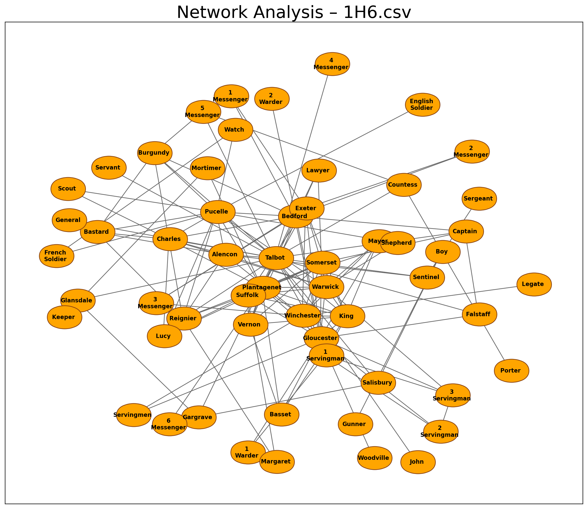
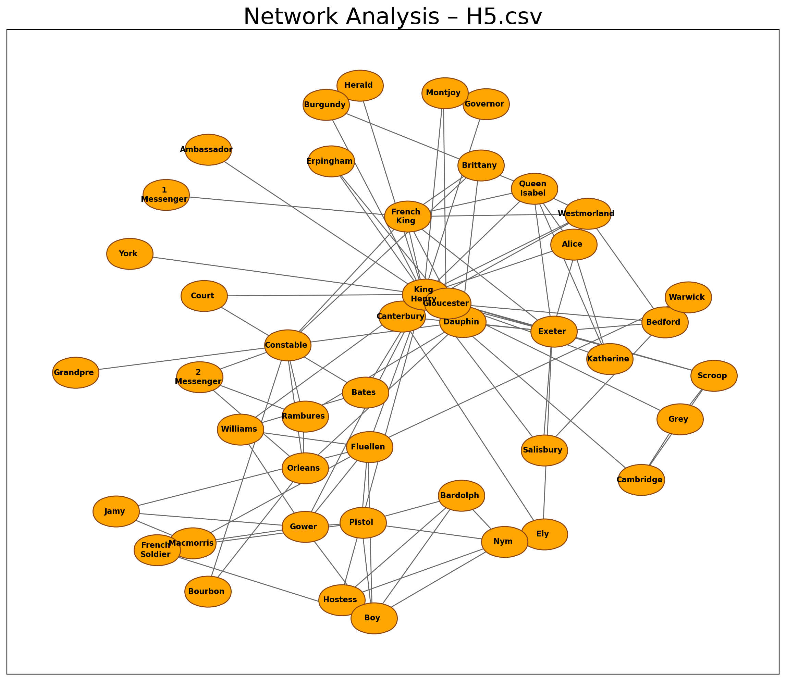
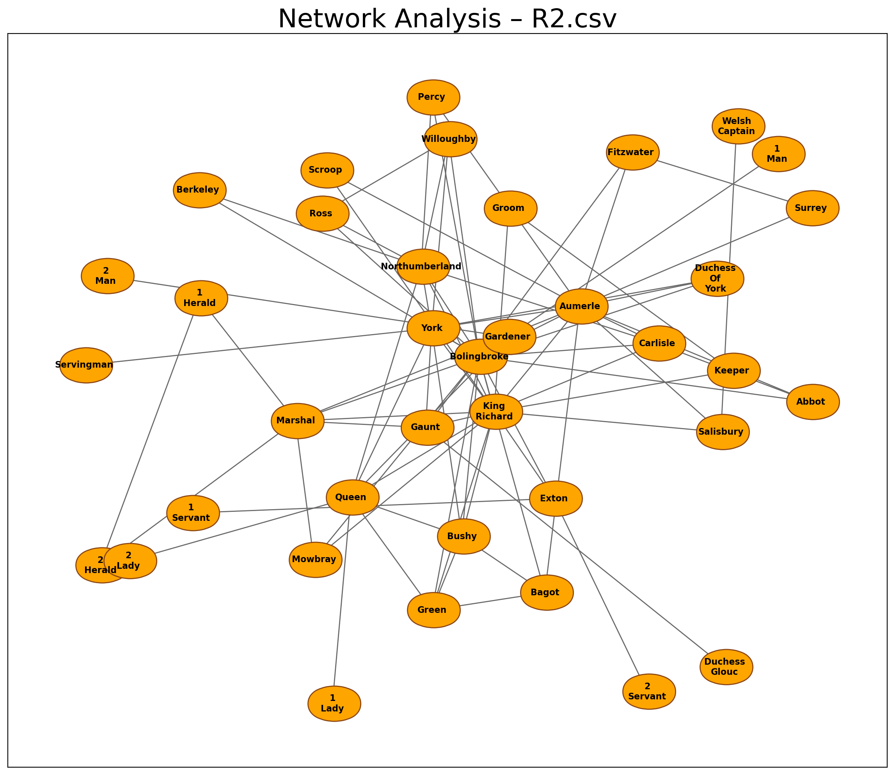

# Assignment 3 – Network analysis
The portfolio for __Language Analytics S22__ consists of 5 projects (4 class assignments and 1 self-assigned project). This is the __third assignment__ in the portfolio. 

## 1. Contribution
The initial assignment was made partly in collaboration with others from the course, but the final code is my own. I made several adjustments to the code since I first handed it in.

https://towardsdatascience.com/customizing-networkx-graphs-f80b4e69bedf

## 2. Assignment description by Ross
### Main task
In this assignment, you are going to write a ```.py``` script which can be used for network analysis. As we saw last week, pretty much anything can be formalised as a network. We're not going to focus on creating the edgelists for this project; instead, the goal is to have a script that would work the same way on _any_ input data, as long as the input format is correct. 

So, as test data, I recommend that you use the files in the folder called ```network_data```. However, the final script should be able to be resused and work on any undirected, weighted edgelist with the same column names.

Your script should do the following:

- If the user enters a _single filename_ as an argument on the command line:
  - Load that edgelist
  - Perform network analysis using ```networkx```
  - Save a simple visualisation
  - Save a CSV which shows the following for every node:
    - name; degree; betweenness centrality; eigenvector_centrality
- If the user enters a _directory name_ as an argument on the command line:
  - Do all of the above steps for every edgelist in the directory
  - Save a separate visualisation and CSV for each file

### Bonus task
- ```networkx``` offers a range of different plotting algorithms. Select a few of these and allow the user to decide between different options.

## 3. Methods
### Main task


### Bonus task


## 4. Usage
### Install packages
Before running the script, you have to install the relevant packages. To do this, run the following from the command line:
```
sudo apt update
pip install --upgrade pip
# required packages
pip install pandas numpy networkx 
```

### Get the data


__Input:__
markers:https://matplotlib.org/stable/api/markers_api.html#module-matplotlib.markers

font weight:https://matplotlib.org/stable/tutorials/text/text_props.html

colours:https://matplotlib.org/stable/gallery/color/named_colors.html.
### Main task


### Bonus task


## 5. Discussion of results


**Network plots**                        |  
:---------------------------------------:|:---------------------------------------:
           |         
           |  
           |  
            |         
            |         


