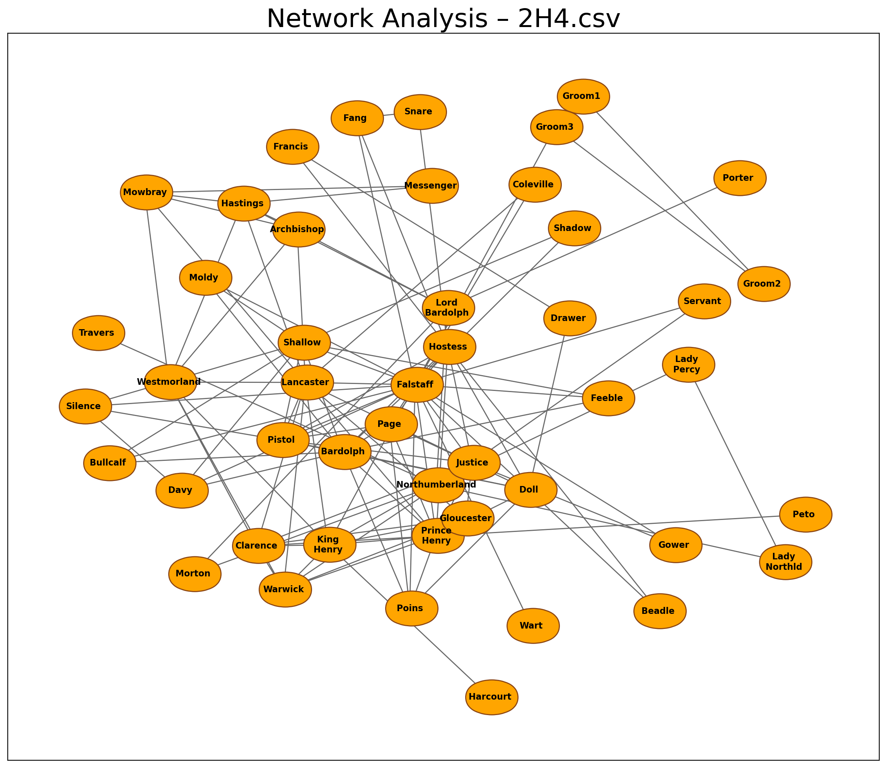
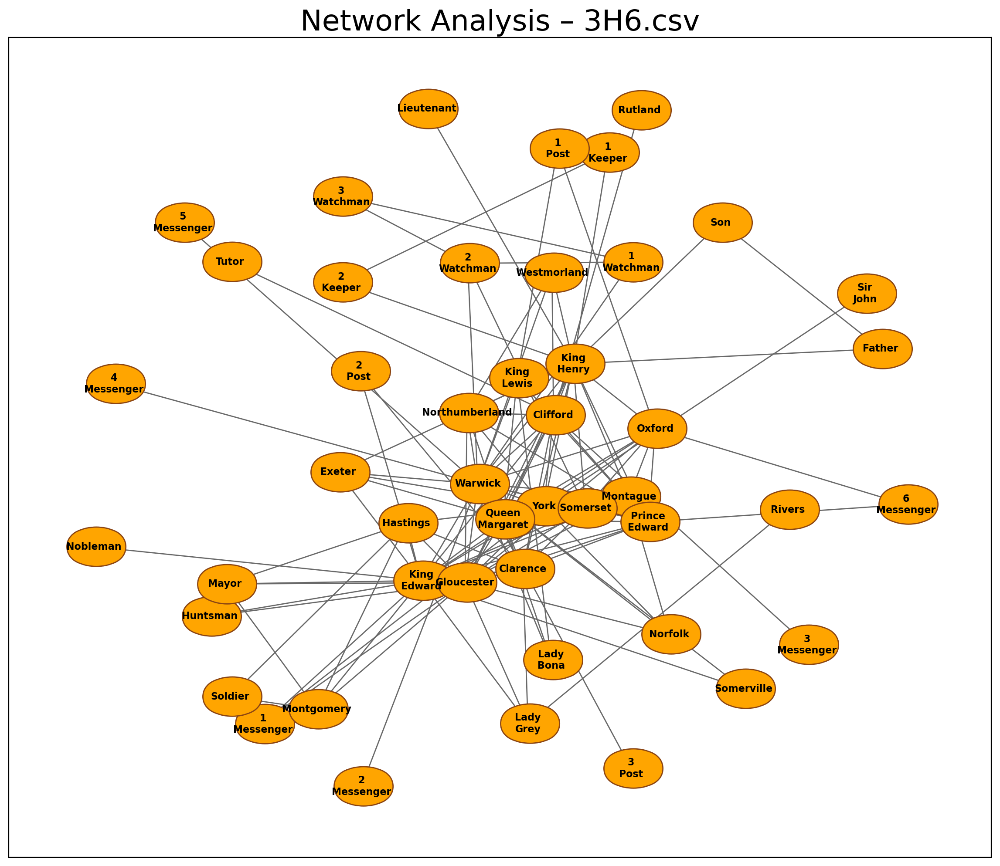

# Assignment 3 – Network analysis
The portfolio for __Language Analytics S22__ consists of 5 projects (4 class assignments and 1 self-assigned project). This is the __third assignment__ in the portfolio. 

## 1. Contribution
The initial assignment was made partly in collaboration with others from the course, but the final code is my own. I made several adjustments to the code since I first handed it in. I found inspiration from this [blog post](https://towardsdatascience.com/customizing-networkx-graphs-f80b4e69bedf) to make the `NetworkX` plots more readable.

## 2. Assignment description by Ross
### Main task
In this assignment, you are going to write a ```.py``` script which can be used for network analysis. As we saw last week, pretty much anything can be formalised as a network. We're not going to focus on creating the edgelists for this project; instead, the goal is to have a script that would work the same way on _any_ input data, as long as the input format is correct. 

So, as test data, I recommend that you use the files in the folder called ```network_data```. However, the final script should be able to be resused and work on any undirected, weighted edgelist with the same column names.

Your script should do the following:

- If the user enters a _single filename_ as an argument on the command line:
  - Load that edgelist
  - Perform network analysis using ```networkx```
  - Save a simple visualisation
  - Save a CSV which shows the following for every node:
    - name; degree; betweenness centrality; eigenvector_centrality
- If the user enters a _directory name_ as an argument on the command line:
  - Do all of the above steps for every edgelist in the directory
  - Save a separate visualisation and CSV for each file

### Bonus task
- ```networkx``` offers a range of different plotting algorithms. Select a few of these and allow the user to decide between different options.

## 3. Methods
### Main task
The [network_analysis.py](https://github.com/agnesbn/LANG_assignment3/blob/main/src/network_analysis.py) script loads an edgelist, 

### Bonus task
Adding a number of arguments with `argparse.ArgumentParser()` allows for the user to define a number of parameters for plotting the network, such as the colour of the nodes and their outline, the colour and width of the edges, the size and shape of the nodes, font size and weight, and the distance between the nodes. I also added an argument for the user to decide what centrality metric the output CSV should be sorted by.


## 4. Usage
### Install packages
Before running the script, you have to install the relevant packages. To do this, run the following from the command line:
```
sudo apt update
pip install --upgrade pip
pip install pandas numpy networkx 
```

### Get the data
- The data should be provided to the examiner by Ross.
- Place the data folder in the `in` folder so that the path is `in/network_data`.

### Main and bonus task
Make sure your current directory is the ´LANG_assignment3` folder. Then from the command line, run:
```
python src/network_analysis.py (--filename <FILENAME> --directory_name <DIRECTORY NAME>) 
(--sort_csv_by <CENTRALITY METRIC>) (--node_color <NODE COLOUR> --edgecolors <NODE OUTLINE COLOUR> 
--edge_color <EDGE COLOUR> --node_shape <NODE SHAPE> --node_size <NODE SIZE> --width <EDGE WIDTH> 
--font_size <FONT SIZE> --font_weight <FONT WEIGHT> --node_distance <NODE DISTANCE>)
```

__Data loading arguments__: Only put in one of these arguments!
- `<FILENAME>`: The name of the CSV file, you want to work with, e.g. `1H4.csv`.
- `<DIRECTORY NAME>`: The name of the directory of edgelists, you want to work with, e.g. `network_data`.

__Data saving arguement__:
- `<CENTRALITY METRIC>`: The centrality metric you wish for the output CSV to be sorted by. Put in `degree_centrality`, `eigenvector_centrality`, or `betweenness_centrality`. The default is `degree_centrality`.

__Network plotting arguments__:
- `<NODE COLOUR>`: The colour of the nodes in the network plot. The default is `orange`.
- `<NODE OUTLINE COLOUR>`: The colour of the outline of the nodes in the network plot. The default is `saddlebrown`.
- `<EDGE COLOUR>`: The colour of the edges (i.e. lines between nodes) in the network plot. The default is `dimgrey`.
    - For other colour names, see this [documentation](https://matplotlib.org/stable/gallery/color/named_colors.html).
- `<NODE SHAPE>`: The shape of the nodes. The default is `$\u2B2C$` which is a horisontal ellipse.
    - For different possibilities for node shapes, see the [documentation](https://matplotlib.org/stable/api/markers_api.html#module-matplotlib.markers) for matplotlib.markers.
- `<NODE SIZE>`: The size of the nodes. The default is `2700`.
- `<EDGE WIDTH>`: The line width of the edges. The default is `1`.
- `<FONT SIZE>`: The font size of the node labels. The default is `8`.
- `<FONT WEIGHT>`: The font weight of the node labels. The default is `heavy`.
    - For different font weights, see this [documentation](https://matplotlib.org/stable/tutorials/text/text_props.html).
- `<NODE DISTANCE>`: The distance between nodes. The default is `0.9`.


## 5. Discussion of results
The final plots can be seen here. Making the `NetworkX` networks readable took some adjustment. Though this is the most readable I could make them, they are still not perfect. There are a few node labels that go outside of the nodes, and some nodes overlap. To avoid stacking and overlapping of the nodes, I set the node distance rather high (0.9), which also blurs the "clusteredness" of the network. But, the user can continue to make small adjustments to the plots by putting in different network plotting arguments to see if it is possible to make the plots more readable. And in any case, the current plots are much more readable now than in my [initial assignment](https://github.com/agnesbn/assignments-cds-lang/blob/main/assignment3/out/network_1H6.png).

           |
:---------------------------------------:|:---------------------------------------:
           |  
           |  
            |         
            |         


